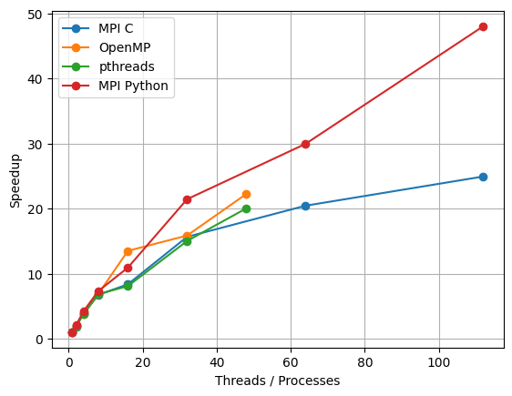
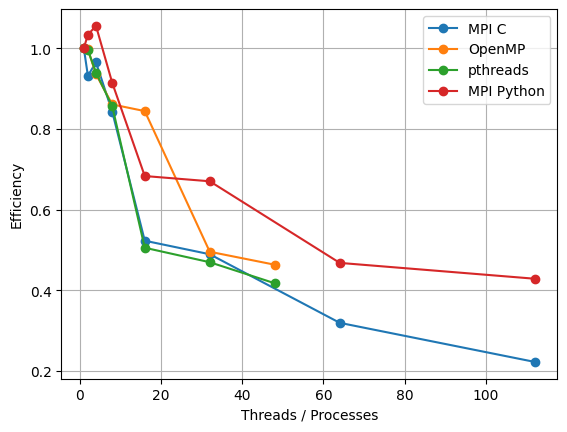

# Методы Монте-Карло и параллельная стохастическая оптимизация

**Дисциплина:** Параллельное программирование на суперкомпьютерах  

**Прикладная задача:** минимизировать значение функции

---

## 1. Введение

Методы Монте-Карло представляют собой класс стохастических алгоритмов, широко применяемых для задач оптимизации, численного интегрирования и моделирования. Основным преимуществом этих методов является их естественная параллелизуемость: отдельные случайные выборки не зависят друг от друга и могут вычисляться одновременно.

В данной работе метод Монте-Карло применяется для минимизации функции:

$$
f(x) = (2 - x)^2, \quad x \in [-10, 10]
$$

Целью работы является исследование эффективности распараллеливания алгоритма с использованием различных моделей параллельного программирования.

---

## 2. Постановка задачи и алгоритм

### 2.1 Математическая постановка

Требуется найти:

$$
\min_{x \in [a,b]} f(x)
$$

где:
- $a = -10$
- $b = 10$

Аналитическое решение:
$$
x^* = 2
$$

### 2.2 Алгоритм Монте-Карло

Алгоритм состоит из следующих шагов:

1. Генерация $N$ случайных значений $x$ равномерно на интервале $[a,b]$
2. Вычисление значения функции $f(x)$
3. Сохранение минимального значения и соответствующего аргумента
4. Возврат лучшей найденной оценки

---

## 3. Параллельные реализации

### OpenMP (C)
Распараллеливание цикла генерации случайных чисел с использованием директив OpenMP.

### POSIX Threads (C)
Явное создание потоков и ручное управление синхронизацией.

### MPI (C)
Распределение вычислений между процессами с использованием `MPI_Reduce`.

### MPI (Python)
Реализация MPI-подхода с использованием библиотеки `mpi4py`.

---

## 4. Экспериментальная установка

- **Система:** суперкомпьютер под управлением SLURM
- **Языки:** C, Python 3.11
- **Библиотеки:** OpenMP, pthreads, OpenMPI, mpi4py
- **Количество выборок:** $N = 10^8$

Все C-реализации компилировались непосредственно на суперкомпьютере.

---

## 5. Результаты

**Производительность MPI (C):**
| Processes | Time (s) |
|:----------|:--------:|
| 1         | 0.4886   |
| 2         | 0.2622   |
| 4         | 0.1266   |
| 8         | 0.0725   |
| 16        | 0.0584   |
| 32        | 0.0312   |
| 64        | 0.0239   |
| 112       | 0.0196   |

**Производительность pthreads:**
| Threads | Time (s) |
|:--------|:--------:|
| 1       | 0.4869   |
| 2       | 0.2445   |
| 4       | 0.1296   |
| 8       | 0.0711   |
| 16      | 0.0602   |
| 32      | 0.0324   |
| 48      | 0.0243   |

**Производительность OpenMP:**
| Threads | Time (s) |
|:--------|:--------:|
| 1       | 0.4916   |
| 2       | 0.2466   |
| 4       | 0.1314   |
| 8       | 0.0714   |
| 16      | 0.0364   |
| 32      | 0.0310   |
| 48      | 0.0221   |

**Производительность MPI (Python):**
| Processes | Time (s) |
|:----------|:--------:|
| 1         | 118.60   |
| 2         | 57.38    |
| 4         | 28.10    |
| 8         | 16.22    |
| 16        | 10.85    |
| 32        | 5.53     |
| 64        | 3.96     |
| 112       | 2.47     |

## 6. Ускорение и эффективность:

**Ускорение:**

$$ S(p) = \frac{T(1)}{T(p)} $$

T(1) — время выполнения с одним потоком/процессом,
T(p) — время выполнения с p потоками/процессами.

**Эффективность:**

$$ E(p) = \frac{S(p)}{p} $$

T(1) — время выполнения с одним потоком/процессом,
T(p) — время выполнения с p потоками/процессами.

## 7. Заключение:
В данной работе был реализован алгоритм оптимизации Монте-Карло с использованием четырех различных моделей параллельного программирования. Эксперименты показывают, что методы Монте-Карло хорошо поддаются распараллеливанию, обеспечивая существенное ускорение как в системах с общей памятью, так и в системах с распределенной памятью.
OpenMP и pthreads хорошо подходят для параллелизма на одном узле, в то время как MPI обеспечивает масштабируемое выполнение на множестве процессов. Python с MPI, несмотря на более высокие накладные расходы, остается жизнеспособным вариантом для быстрого прототипирования и образовательных целей.

